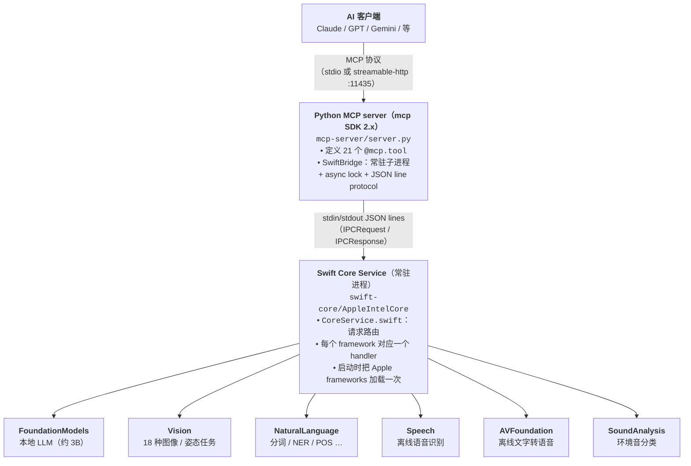

# Apple Intelligence MCP Server

[English](README.md) | [繁體中文](README.zh-Hant.md) | **简体中文**

[](https://github.com/falll2000/apple-intelligence-mcp/actions/workflows/python.yml)

把 macOS 内置的 Apple Intelligence 框架（Foundation Models、Vision、Natural
Language、Speech、Sound Analysis）封装成 21 个 [MCP](https://modelcontextprotocol.io)
工具，提供给 Claude Desktop、OpenAI、Gemini、Codex、Hermes 等支持 MCP 的 AI
客户端使用。

所有计算 **100% 在你的 Mac 本地完成**。不需要 API key、不走云端、数据不出本机。

---

## 概览

### 这个项目是干嘛的

OCR、翻译、摘要、语音识别这类流程固定、量又大的任务，全扔给云端 LLM 烧 token
其实挺不划算的。Apple Silicon Mac 本身就内置一套相当能打的本地 AI 模型——只是
要会写 Swift 才能直接调用。

这个项目把那套模型封装成一个 MCP 服务，让 Claude、GPT、Gemini 等 AI 客户端
可以直接把活儿派给你的 Mac：「OCR 这张图」、「转录这段录音」、「润色这条
Discord 消息」、「总结这份会议纪要」——全在本地毫秒级完成，还不要钱。

### 能拿来做什么

- **Discord / 聊天助手**
  用 `proofread_text` 抓错字、`rewrite_text(tone="professional")` 改语气、
  `summarize_text` 压缩长消息。三个工具都会保留 `@提及`、`:emoji:`、code block
  以及原始语言。
- **文档处理流水线**
  `vision_analyze(mode="ocr")` → `generate_text_structured(schema="extract")`
  → `generate_text_structured(schema="summarize")`，把扫描 PDF 或拍照文档变成
  结构化字段加摘要。
- **语音消息流水线**
  `transcribe_audio` → `summarize_text` → `synthesize_speech`，组一条
  「语音进、语音出」的完整本地流水线。
- **照片整理**
  用 `vision_analyze` 的 `classify`、`aesthetics`、`document` 模式配合
  `image_similarity` 给本地相册分类。
- **隐私敏感的转录与翻译**
  法律、医疗、HR 这类不能让音频或内容上云的场景。
- **省 token 费**
  把翻译、批量改写、情感分类这种重复性高的任务交给本地（搭配下面的
  「推荐的 host system prompt」），云端 token 留给真正需要推理的任务。

---

## 快速开始

### 系统要求

- Apple Silicon Mac（M1 及以上）
- macOS 26（Tahoe）及以上
- 已开启 Apple Intelligence（系统设置 → Apple Intelligence 与 Siri）
- 完整 Xcode（光装 Command Line Tools 不够，缺 FoundationModels 宏）
- Homebrew + Python 3.10+（`brew install python3`）

### 安装

```bash
git clone https://github.com/falll2000/apple-intelligence-mcp.git
cd apple-intelligence-mcp
bash install.sh
```

脚本会自动做：

1. 编译 Swift Core Service（`swift build -c release`）
2. 建好 Python venv 并装 `mcp` Python SDK（2.x）
3. 把服务（`com.apple-intel-mcp.server`）注册成 launchd agent，监听 11435 端口
4. 打印出对应你机器路径的客户端配置，直接复制粘贴就行

### 接到 AI 客户端

**Claude Desktop（stdio 模式）** — 编辑
`~/Library/Application Support/Claude/claude_desktop_config.json`：

```json
{
  "mcpServers": {
    "apple-intelligence": {
      "command": "/path/to/apple-intelligence-mcp/mcp-server/venv/bin/python3",
      "args": ["/path/to/apple-intelligence-mcp/mcp-server/server.py", "--stdio"]
    }
  }
}
```

实际路径 `install.sh` 跑完会打印出来，照着贴即可。

**其他客户端（HTTP 模式）** — 开机登录后 launchd 会自动起 HTTP server：

```
http://127.0.0.1:11435/mcp
```

**OpenClaw** — 在 `~/.openclaw/openclaw.json` 的 `mcp.servers` 底下注册。HTTP server
已由 launchd 常驻，所以让 OpenClaw 直接连它即可（不必让 OpenClaw 自己拉起进程）：

```json
{
  "mcp": {
    "servers": {
      "apple-intelligence": {
        "url": "http://127.0.0.1:11435/mcp",
        "transport": "streamable-http",
        "connectionTimeoutMs": 10000,
        "requestTimeoutMs": 300000
      }
    }
  }
}
```

或者用 CLI 注册，免手改文件：

```bash
openclaw mcp set apple-intelligence \
  '{"url":"http://127.0.0.1:11435/mcp","transport":"streamable-http","requestTimeoutMs":300000}'
openclaw mcp list                        # 确认已注册
openclaw mcp probe                       # 实际连接，列出它声明了什么
```

用 `openclaw mcp configure apple-intelligence` 做 per-server 调整（OpenClaw 2026.9+）：

| CLI 旗标 | `openclaw.json` 字段 | 用途 |
|---|---|---|
| `--include` / `--exclude` | `toolFilter.include` / `toolFilter.exclude` | 要暴露／隐藏的工具名，支持 `*` glob |
| `--approval auto\|prompt\|approve` | `codex.defaultToolsApprovalMode` | 工具批准模式 |
| `--timeout` | `requestTimeoutMs` | 单次调用超时。OpenClaw 默认 **60 秒**，远低于本 server 自己的 300 秒防呆上界，请调高；否则长音频转写、视频分析会在 server 还在跑的时候就被 client 放弃 |
| `--connect-timeout` | `connectionTimeoutMs` | 连接超时 |
| `--parallel` | `supportsParallelToolCalls` | 不要开。OpenClaw 默认就是每台 server 串行；开了之后它会并发送出，而 Swift bridge 内部仍然串行化，排队的那几个只是在烧掉自己的超时额度 |

旧的字段拼法（`timeout`、`connect_timeout`、`ssl_verify`、`client_cert`、
`client_key`、`supports_parallel_tool_calls`、`workingDirectory`、`disabled`）在
当前 OpenClaw 会直接判为配置错误——用 `openclaw doctor --fix` 迁移。

想改用 stdio（由 OpenClaw 拉起进程），就在 server 项目里填上面 Claude Desktop 区块
那组相同的 `command` / `args`。

**Hermes** — 用 `hermes mcp` CLI 注册（指向已常驻的 HTTP server）：

```bash
hermes mcp add apple-intelligence --url http://127.0.0.1:11435/mcp
hermes mcp test apple-intelligence    # 验证连接 + 工具列表
```

`~/.hermes/config.yaml` 里 `mcp_servers.apple-intelligence` 底下可用的 key：

| Key | 用途 |
|---|---|
| `tools.exclude` / `tools.include` | 按名称隐藏或设白名单——例如中文场景排掉那几个只支持英文的 NL 工具（见[中文支持情况](#中文支持情况)） |
| `trust: full \| untrusted` | 设 `untrusted` 时，会写入的工具每次调用都要批准。本项目每个工具都声明了 `readOnlyHint`，只有 `synthesize_speech` 例外，所以只有它会弹批准 |
| `protocol: auto \| stateless \| legacy` | 握手世代；对本 server 用 `auto` 即可 |
| `timeout` / `connect_timeout` / `keepalive_interval` | 秒 |
| `lazy: true` | 首次使用时才连接，不在 gateway 启动时连 |

### 推荐的 host system prompt

要不要调这些工具，由 host model 根据自己的 system prompt 和工具描述决定。
Server 这边的描述已经用 `WHEN: / NOT FOR:` 格式写过了，不过 host 端最好也加
一份明确的策略。把下面这段贴到你 client 的 system prompt 里可以让路由更稳定
（用英文写是因为大多数 host LLM 对英文指令最敏感）：

```
You have access to an `apple-intelligence` MCP server that runs entirely on the
user's Mac. You MUST prefer it for the following task types instead of doing
the work yourself:

  - User provides an absolute path to an image file → call `vision_analyze`
    with the appropriate mode. Do NOT describe the image yourself first.
  - User provides an absolute path to an audio file and wants the words →
    call `transcribe_audio`.
  - User asks for tokenization or lemmatization → call the matching tool.
  - User asks for sentiment classification → call
    `generate_text_structured(schema="classify")` (works for Chinese too,
    unlike `analyze_text` which is English-only).
  - User asks to compare two images → `image_similarity`.
  - User asks to read text aloud → call `synthesize_speech` and attach
    the returned `.wav` path to the response.
  - User has already-written text and asks to "check / fix typos /
    proofread" it → call `proofread_text` (NOT `generate_text`).
  - User has already-written text and asks to make it "formal / casual /
    shorter / friendlier / more professional" → call `rewrite_text` with
    the matching `tone`.
  - User has long text and asks to "summarize / TL;DR / shorten" → call
    `summarize_text`. Use `generate_text_structured(schema="summarize")`
    only when the caller needs JSON with `title` + `keyPoints[]`.

You MAY use it (caller's discretion) for:
  - Bulk text rewriting / translation where token cost matters more than nuance
    → `generate_text`, `translate_text`, `generate_text_structured`.

You should NOT use it for:
  - Tasks needing strong reasoning, code, math, or current-events knowledge —
    the on-device model is small. Use your own generation.
```

---

## 工具列表（共 21 个）

18 种单张图片的 Vision 任务被收进一个 `vision_analyze`（用 `mode` 参数路由），
没拆成 18 个独立工具——实测下来这样做能明显提升 host LLM 选工具的准确度。

每个工具都声明了 MCP 的 `readOnlyHint` annotation，只有 `synthesize_speech` 会写文件。
会依 annotation 决定是否拦截调用的 host（OpenClaw 的批准模式、hermes 的 trust 分级）
需要这个信息，否则会把每个工具都当成有写入风险。

### Foundation Models — 本地 LLM

| 工具 | 说明 |
|------|-------------|
| `generate_text` | 通用文字生成 / 改写 |
| `generate_text_structured` | Guided generation，输出 JSON 结构固定。Schemas：`list` / `classify` / `summarize` / `extract` / `qa`（每个 schema 各自的 prompt 建议都写在工具描述里） |
| `translate_text` | zh-Hant / zh-Hans / en / ja / ko / fr / de / es 互译，每个目标语言用该语言写的 instructions |
| `proofread_text` | 抓用户文字里的错字、语法、标点。保留语气、语言、Discord 语法（@ / :emoji: / code block） |
| `rewrite_text` | 改写语气（`formal` / `casual` / `concise` / `friendly` / `professional`），保留原意、语言、Discord 语法 |
| `summarize_text` | 压缩成 `short` / `medium` / `long` 段落；输入中文输出中文、输入英文输出英文 |

### Vision — 图像 / 姿态

**`vision_analyze`** 是单图入口：用一个 MCP 工具，通过 `mode` 参数提供 **18 种不同
的 Vision 能力**（一次选一种）：

| `mode` | 能力 |
|--------|------|
| `ocr` | 从图片提取文字（zh-Hant / zh-Hans / en / ja / ko） |
| `classify` | 场景 / 物体标签与置信度 |
| `faces` | 人脸数量 + 边界框 |
| `face_landmarks` | 每张脸的眼 / 鼻 / 嘴 / 轮廓特征点 |
| `barcodes` | QR / EAN-13 / Code-128 / PDF417 等 |
| `text_regions` | 只返回文字边界框（不做 OCR 内容） |
| `contours` | 边缘 / 轮廓检测 |
| `human_bodies` | 人体边界框（`upper_body_only=True` 只取上半身） |
| `rectangles` | 矩形区域（卡片、屏幕、白板） |
| `horizon` | 地平线角度——照片有没有歪？ |
| `saliency` | 视觉注意力热区图 |
| `document` | 纸张 / 文档边界框 |
| `segment_person` | 人物存在与遮罩大小 |
| `segment_foreground` | 各实例前景遮罩 |
| `aesthetics` | 美学评分 0–1 + 工具性图片标记 |
| `body_pose` | 2D 人体关节（15 个关键点） |
| `hand_pose` | 手部关节 + 左 / 右手 |
| `animals` | 猫 / 狗检测 |

> **为什么用一个 router，而不是 18 个工具？** 这每一种底层都是独立的 Apple Vision
> request（Swift core 里也各是一个 `case`），但它们的输入完全相同——一个本地图片
> 路径。把它们收成单一的 `vision_analyze(mode=...)`，比起对外声明 18 个几乎一样的
> 工具，实测能明显提升 host LLM 选工具的准确度，也缩小每次请求都要携带的工具清单
> token。第 19 种能力 `body_pose_3d` 在 Swift core 里存在，但**刻意不**开成
> mode——详见 [已知限制](#已知限制)。

其余 Vision 工具保持独立，因为它们的输入不同（视频、两张图、或自备模型，而非单张
图片路径）：

| 工具 | 说明 |
|------|-------------|
| `image_similarity` | **两张**本地图片的视觉相似度（Vision feature print L2 距离，阈值已调成 0.1 / 0.4 / 0.8） |
| `detect_optical_flow` | **两张**连续帧之间的逐像素运动向量 |
| `detect_trajectories` | 在本地**视频**中检测抛物线轨迹 |
| `detect_objects` | 用你**自备的 Core ML 模型**（`.mlmodel` / `.mlmodelc`）做物体检测 |

### Natural Language

| 工具 | 说明 |
|------|-------------|
| `analyze_text` | 情感 + 语言检测 + 命名实体 + 关键词 |
| `tokenize_text` | 把文字切成词 / 句 / 段（多语言；中文分词正常） |
| `tag_parts_of_speech` | 词性标注 |
| `lemmatize_text` | 词形还原（running → run） |
| `word_similarity` | 两个词的语义相似度（0–1） |
| `sentence_similarity` | 两个句子的语义相似度（0–1） |

### Speech & Sound

| 工具 | 说明 |
|------|-------------|
| `transcribe_audio` | 离线语音识别（zh-TW / zh-CN / en-US / ja-JP / …），已启用标点与口述模式 |
| `synthesize_speech` | 用 AVSpeechSynthesizer 离线文字转语音 → 输出 `.wav`（默认 zh-TW Meijia） |
| `list_voices` | 列出所有可用声音 identifier，可用 BCP-47 前缀过滤 |
| `classify_sound` | 环境音分类（音乐、笑声、犬吠…）；输入至少 3 秒 |

---

## 工具行为与限制

### 中文支持情况

Apple 各 framework 对语言的支持程度差距很大。Vision、Speech、Foundation Models
对中文都不错；比较老的 NaturalLanguage 和 NLEmbedding 在这套 stack 上实际几乎
只能处理英文。

| 工具 | 中文（zh-Hant / zh-Hans） |
|---|---|
| `vision_analyze`（所有 mode） | ✓ 支持良好 |
| `transcribe_audio` | ✓ 准确（Apple 模型只加逗号、不加句号） |
| `synthesize_speech` | ✓ 有 Meijia、Eloquence 等中文声音可选 |
| `tokenize_text` | ✓ 中文分词正常（「牛肉面」会作为一个 token 保留） |
| `lemmatize_text` | ✓ 中文不会被乱改（中文没有词形变化） |
| `generate_text_structured`（`classify`） | ✓ 可用于中文情感分类 |
| `translate_text` | ✓ zh→en / zh→ja 稳定；en→zh 会用大陆 / 港澳台常见译名（苹果商店、特斯拉）；成语会直译 |
| `proofread_text` | ⚠ 语言保留正确；FM 对中文语法错误（一各 / 再 / 的-vs-得）抓得偏弱，英文偶尔漏抓主谓一致 |
| `rewrite_text` | ✓ 语言保留正确；`professional` / `concise` / `formal` 稳定；`casual` / `friendly` 偶尔会改写过头 |
| `summarize_text` | ✓ 语言保留正确（中→中、英→英）；`short` 偶尔不够短 |
| `generate_text` | ⚠ 短 prompt OK；知识截止约 2023 |
| `classify_sound` | ⚠ 跟语言无关，但排序偶尔不准 |
| `analyze_text` | ✗ 中文情感永远是 0 / 中性，命名实体几乎抓不到 |
| `tag_parts_of_speech` | ✗ 中文所有词性都会标成「其他」 |
| `word_similarity` / `sentence_similarity` | ✗ 没有加载中文 embedding 模型 |

主要做中文场景时，建议在 host 的 MCP 配置层直接把 ✗ 那四个排除掉（比如
hermes 的 `mcp_servers.<name>.tools.exclude`），这样 host LLM 就不会把中文
请求路由过去。

### 已知限制

**Foundation Models 自带的 safety filter** — `generate_text` 跟相关工具有时
会对某些内容直接报错。这个 filter 是 Apple 模型内置的，不是这个 server 加的。
连看起来人畜无害的字（比如品牌名里的「胖」）都可能被拦——容易踩雷的内容建议
改走 `generate_text_structured`。

**`detect_objects`** 需要你自备 Core ML 模型（`.mlmodel` 或 `.mlmodelc`）。
其他工具都开箱即用。

**`detect_trajectories`** 需要 mp4 / mov 视频文件，对抛物线运动（球类运动）
效果最好。

**`body_pose_3d` 已经从公开 mode 列表里移掉了。**
`VNDetectHumanBodyPose3DRequest` 在跑 `perform` 时会抛出 Swift 接不住的
Objective-C exception，整个 Swift Core 进程会被它干掉。Swift case 还保留作为
兜底（老的 client 还在传这个 mode 的话会收到 `unavailable`），但对外不再宣传。
要做姿态检测请改用 `mode="body_pose"`（2D pose）。

**Apple Intelligence 天花板** — 下面这几个 macOS 26 API 在 SDK 里*看起来*能用，
实际上从 daemon 是调不动的：

| API | 为什么被拦 |
|---|---|
| Writing Tools（`NSWritingToolsCoordinator`） | 绑 UI（需要 `NSView`）。我们改用 Foundation Models 自己 prompt 出 `proofread_text` / `rewrite_text` / `summarize_text` 来替代 |
| Image Playground（`ImageCreator`） | 哪怕在 Terminal 里跑也会返回 `backgroundCreationForbidden`——Apple 限定 entitlement |
| Genmoji | 走 `ImageCreator(style="emoji")`，同一个 entitlement 拦截 |
| Visual Intelligence | 只有 `AppIntents.AssistantSchemas.VisualIntelligenceIntent`，是 schema only，不是真的可调用的 API |
| Smart Reply | `CSSmartReply` 是 internal symbol（只出现在 `.tbd`，没有对外的 header） |

**Vision runtime 测试** 请在 Xcode 构建的 binary、Terminal 或其他非 sandbox
环境跑。Sandbox runner 会误报 `CVPixelBuffer`、`ANECF`、`request cancelled`
之类的错误。

---

## 运维

### 管理服务（HTTP 模式）

`install.sh` 注册的 launchd agent 会在登录时自动起来、crash 后自动重启。
要手动控制：

```bash
bash start.sh                                           # bootstrap launchd agent
bash stop.sh                                            # bootout launchd agent
tail -f /tmp/apple-intel-mcp.log                        # 看 log
launchctl kickstart -k gui/$UID/com.apple-intel-mcp.server   # 强制重启
```

环境变量（写在 launchd plist，或直接跑 `server.py` 时指定）：

| 变量 | 默认 | 含义 |
|---|---|---|
| `APPLE_INTEL_PORT` | `11435` | HTTP 端口 |
| `APPLE_INTEL_CALL_TIMEOUT` | `300` | 单次 Swift Core 调用的秒数上限，超过就杀掉并重启它 |

`APPLE_INTEL_CALL_TIMEOUT` 是防死锁用的上界，不是速度限制——只有在 Swift Core
完全不回应时才会触发。hermes 自己的工具调用默认也是 300 秒，两边本来就一致；
OpenClaw 默认 60 秒，该调的是它的 `requestTimeoutMs`，不是把这个值降下来。

### Agent 生命周期集成（可选）

如果你在跑 agent gateway——[hermes](https://github.com/NousResearch/hermes-agent)（`ai.hermes.gateway`）
或 [OpenClaw](https://openclaw.ai)（`ai.openclaw.gateway`）——并希望它的
start/stop 联动 MCP server：

```bash
bash install-integration.sh    # 装 watchdog
bash uninstall-integration.sh  # 卸载 watchdog（不影响 mcp 本身）
```

这会装一个 launchd agent（`com.apple-intel-mcp.watchdog`），定期轮询这些
gateway，只要有 gateway 在就让 MCP 维持运行。它是 **consumer-aware**：只要**任一** gateway 还在，
MCP 就维持；**全部**都停了才停 MCP。

| Gateway 动作 | MCP 反应（延迟一个轮询周期） |
|---|---|
| 任一 gateway 启动 | `bootstrap` MCP |
| 全部 gateway 停止 | `bootout` MCP |
| 某个 gateway 重启 | 不动作——MCP 维持，由该 gateway 自行重连 |

watchdog 是 **keep-alive only**：gateway 重启时它**不会**重启 MCP。MCP 是稳定的
HTTP endpoint，各 gateway 会自己重连；硬重启它只会无谓打断其他已连接的 agent。
MCP 真的 crash 时，它的 launchd plist（`KeepAlive=true`）会自动拉起。

验证集成状态：

```bash
launchctl print gui/$UID/com.apple-intel-mcp.watchdog
launchctl print gui/$UID/com.apple-intel-mcp.server
```

watchdog 是 interval job，所以两次轮询之间常会显示 `spawn scheduled` 或
`not running`。看 `runs` 和 `last exit code = 0` 就能确认它是否健康。

集成是纯加分项，不装也照样跑。要支持其他 agent，把它的 launchd label 加进
`bin/mcp-watchdog.sh` 的 `CONSUMER_LABELS`，然后重跑
`bash install-integration.sh`，让 `~/Library/Application Support/apple-intel-mcp/`
下的副本刷新。`install.sh` 检测到 gateway 已安装时会主动提示。

手动生命周期脚本仍可使用：

```bash
bash stop.sh   # 先停 watchdog，再停 MCP
bash start.sh  # 先启动 MCP；如果已安装集成，也会启动 watchdog
```

`start.sh` 会在 `/tmp/apple-intel-mcp.manual-start` 放一个标记，这样即使当下没有
任何 gateway 在跑，watchdog 也不会把你刚叫起来的 server 收掉。之后第一次轮询
看到 gateway 就会清掉标记，把 MCP 交还给 gateway 驱动的生命周期；`stop.sh` 和
重启也会清掉它。

> plist 里写的是 `StartInterval` 3，但 launchd 对重复性任务有十秒下限，实际上
> 大约每 10 秒才轮询一次。不要按 3 秒去估算反应时间。

> 实现小备注：watchdog 脚本在 install 时会复制一份到
> `~/Library/Application Support/apple-intel-mcp/`，因为 macOS 26 launchd 拒绝
> 直接从 `/Volumes/` 跑 shell 脚本（会被 TCC 拦成「Operation not permitted」）。
> Python venv binary 没踩到这条。

### 升级

```bash
bash upgrade.sh          # 最新 GitHub Release
bash upgrade.sh v1.2.3   # 指定 GitHub Release tag
```

这会解析 GitHub Release tag、fetch tags、以 detached HEAD 切到该 release、
重建 Swift core、更新 Python venv 依赖、重启或启动已安装的 launchd 服务，
并在 watchdog 已安装时刷新它（顺便把旧的 per-agent watchdog migrate 成统一版）。
如果已追踪文件有本机变更，脚本会在 checkout 前停止，避免覆盖你的修改。
如果 remote 不是标准 GitHub URL，可设置 `APPLE_INTEL_RELEASE_REPO=owner/repo`。

### 卸载

```bash
bash uninstall.sh   # 移除 mcp + watchdog（如果装过）
```

---

## 开发

### 架构



**为什么要拆成两个进程？**
MCP Python SDK 是 Python 原生库；Apple AI 框架只有 Swift 能直接调。Swift 二进制做成
常驻，是因为这些框架光初始化就要好几秒，每次重启太慢。Python 那层很薄，
只处理 MCP 协议、工具描述跟序列化。每次 `bridge.call(...)` 就是往 Swift stdin
写一行 JSON、从 stdout 读回一行 JSON——外面套一层 `asyncio.Lock` 保证请求／
响应不会交错。

### 模块结构

Swift 端 `swift-core/Sources/AppleIntelCore/` 采用「一个 framework 对应一个
handler」的拆法。加新工具有固定流程：

```
main.swift                 ← 入口（await CoreService.run()）
Models.swift               ← IPC 类型（IPCRequest / IPCResponse / JSONValue）
HandlerError.swift         ← 自定义错误（invalidInput / unavailable / …）
CoreService.swift          ← 请求路由——每个工具加一个 `case "<tool>":`
                             转发给对应 handler
GenerateHandler.swift      ← Foundation Models：
                             - generate_text（自由生成）
                             - generate_text_structured（@Generable 结构化）
TranslateHandler.swift     ← 用 FM prompt 做翻译，每个目标语言写一套
                             instructions（绕开 zh→en 时模型误判输入已经是英文的坑）
WritingToolsHandler.swift  ← 校对 / 改写 / 摘要：
                             - NLLanguageRecognizer + CJK 字符比例判断输入语言
                             - 每个语言写一套 instructions（zh-Hant / zh-Hans / en / ja）
                             - Discord-aware：保留 @ / :emoji: / ```code fence```
OCRHandler.swift           ← Vision 文字识别（zh / en / ja / ko）
VisionExtHandler.swift     ← Vision：人脸、条码、轮廓、文字区域、人脸关键点、
                             人体检测、地平线、前景分割、美学评分、光流、
                             自定义 Core ML 物体检测、图像相似度
VisionPoseHandler.swift    ← Vision：2D 姿态、手部姿态、动物、矩形、
                             saliency、文档、人像分割（3D 姿态已封死，见已知限制）
AnalyzeHandler.swift       ← NaturalLanguage：情感、语言检测、命名实体、关键词
NLAdvancedHandler.swift    ← NaturalLanguage：分词、词形还原、词性标注
NLEmbeddingHandler.swift   ← NaturalLanguage：词 / 句语义相似度
TranscribeHandler.swift    ← Speech 离线识别（SFSpeechRecognizer）
SpeechSynthHandler.swift   ← AVFoundation 文字转语音 → 输出 .wav、列出可用声音
SoundHandler.swift         ← SoundAnalysis：环境音分类
```

**新增工具的步骤：**

1. 挑对应的 handler；如果是全新的 Apple framework 就新建一个文件。
2. 写好 Swift function，遇到非法输入用 `HandlerError` throw 出去。
3. 到 `CoreService.swift` 加 `case "<tool_name>":`，解析 params 后调 handler。
4. 到 `mcp-server/server.py` 加一个 `@mcp.tool()` function，docstring 用
   WHEN / NOT-FOR 格式写清楚，内部调 `await bridge.call("<tool_name>", {...})`。
5. 重新 build Swift（`swift build -c release`），重启 MCP
   （`launchctl kickstart -k gui/$UID/com.apple-intel-mcp.server`）。
6. 三份 README（[README.md](README.md)、[繁體](README.zh-Hant.md)、这份）都记得更新。

---

### 项目结构

```
apple-intelligence-mcp/
├── install.sh / upgrade.sh / uninstall.sh
├── install-integration.sh / uninstall-integration.sh
├── start.sh / stop.sh
├── bin/
│   └── mcp-watchdog.sh            # 轮询 hermes/openclaw gateway，联动 mcp 状态
├── mcp-server/
│   ├── server.py                  # MCPServer + SwiftBridge（约 720 行）
│   └── requirements.txt           # mcp>=2,<3
├── swift-core/
│   ├── Package.swift              # macOS 26、Swift 6
│   └── Sources/AppleIntelCore/    # 约 2,500 行，一个 framework 一个 handler
│       ├── main.swift             # 入口
│       ├── CoreService.swift      # 请求路由
│       ├── Models.swift           # IPC 类型
│       ├── HandlerError.swift     # 自定义错误
│       ├── GenerateHandler.swift          # Foundation Models
│       ├── TranslateHandler.swift         # FM 翻译
│       ├── WritingToolsHandler.swift      # 校对 / 改写 / 摘要
│       ├── OCRHandler.swift               # Vision 文字识别
│       ├── VisionExtHandler.swift         # Vision 检测类工具
│       ├── VisionPoseHandler.swift        # Vision 姿态 / 动态类工具
│       ├── AnalyzeHandler.swift           # NL 情感 / NER / 关键词
│       ├── NLAdvancedHandler.swift        # NL 分词 / POS / 词形还原
│       ├── NLEmbeddingHandler.swift       # NL 语义相似度
│       ├── TranscribeHandler.swift        # Speech 语音识别
│       ├── SpeechSynthHandler.swift       # AVFoundation 文字转语音
│       └── SoundHandler.swift             # SoundAnalysis 环境音分类
└── test-assets/                   # 测试用示例图
```

---

## 免责声明

本项目仅供学习与个人生产力用途，按「现状」提供，不附带任何形式的担保。你需自行
为所处理的内容负责，并遵守相关法律以及你所接触的任何第三方网站或服务的服务条款。
作者对任何滥用行为不承担任何责任。

---

## 许可证

MIT
