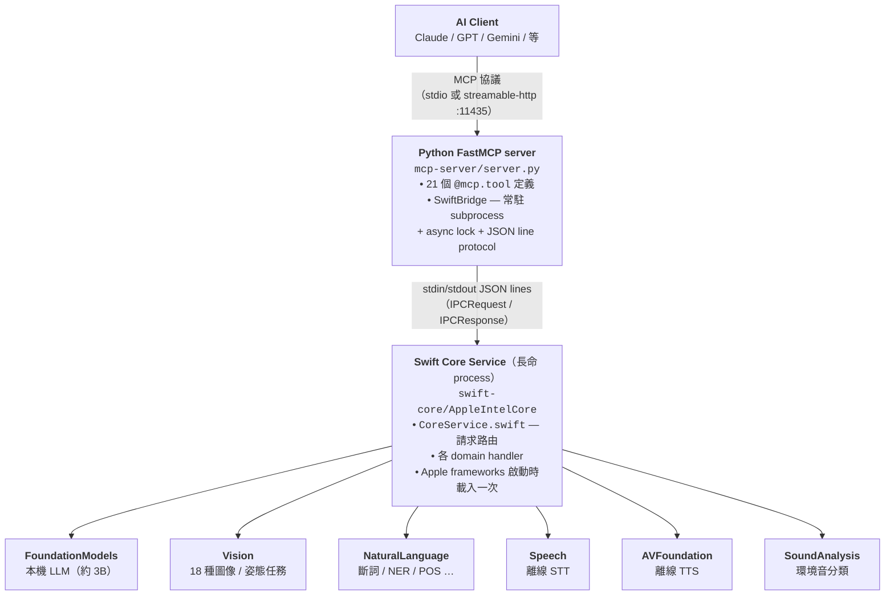

# Apple Intelligence MCP Server

[English](README.md) | **繁體中文**

一個 [Model Context Protocol](https://modelcontextprotocol.io) server，把 Apple
本機 AI 堆疊——**Foundation Models、Vision、Natural Language、Speech、Sound
Analysis**——包成 21 個工具，讓任何支援 MCP 的 client 都能呼叫（Claude
Desktop、OpenAI、Gemini、Codex、Hermes…）。

一切都在 **100% 本機執行**。沒 API key、沒雲端往返、資料不離開你的 Mac。

---

## 為什麼做這個

雲端 LLM token 對大量、決定性的工作（翻譯、摘要、OCR、轉錄）非常浪費。Apple
Silicon Mac 本身已經內建一套相當夠用的 AI 堆疊——Foundation Models、Vision、
Speech——但要 Swift 才能用。這個 server 把那套堆疊包成單一 MCP endpoint，讓
任何 host LLM（Claude、GPT、Gemini）能把瑣碎工作丟給你的 Mac，而不是燒 token。

具體用法：host model 可以說「OCR 這張圖」、「把這段語音轉成文字」、「幫我
潤稿這段 Discord 回覆」、「摘要這份會議紀錄」——工作就在本機毫秒內完成、免費。

## 可以拿來做什麼

- **Discord / 聊天助手**
  `proofread_text`、`rewrite_text(tone="professional")`、`summarize_text`
  會保留 `@提及`、`:emoji:`、code fence、輸入語言。
- **文件處理流水線**
  `vision_analyze(mode="ocr")` → `generate_text_structured(schema="extract")` →
  `generate_text_structured(schema="summarize")`，把掃描 PDF 或照片轉成結構化
  欄位 + 摘要。
- **語音訊息流水線**
  `transcribe_audio` → `summarize_text` → `synthesize_speech`，建一條完整
  「語音進、語音出」的本機 loop。
- **圖像整理**
  `vision_analyze(mode="classify"/"aesthetics"/"document")` 加
  `image_similarity` 做本地照片分類。
- **隱私敏感的轉錄 / 翻譯**
  法律、醫療、HR 等不能讓音訊或文字離機的場景。
- **AI client 的 token 成本最佳化**
  用下面推薦的 host system prompt，把翻譯／批次改寫／情感分類丟給本機模型，
  雲端 token 留給真的需要推理的任務。

---

## 系統需求

- Apple Silicon Mac（M1 或更新）
- macOS 26（Tahoe）或更新
- 已啟用 Apple Intelligence（系統設定 → Apple 智慧與 Siri）
- 完整 Xcode（光裝 Command Line Tools 不夠，缺 FoundationModels 巨集）
- Homebrew + Python 3.10+（`brew install python3`）

## 安裝

```bash
git clone https://github.com/falll2000/apple-intelligence-mcp.git
cd apple-intelligence-mcp
bash install.sh
```

腳本會做：
1. 編譯 Swift Core Service（release build，`swift build -c release`）
2. 建立 Python venv 並裝 `mcp`（FastMCP）
3. 把 server 註冊成 launchd agent（`com.apple-intel-mcp.server`），listen on port 11435
4. 印出你機器上實際的設定片段

## 接到 client

**Claude Desktop（stdio）** — 編輯 `~/Library/Application Support/Claude/claude_desktop_config.json`：

```json
{
  "mcpServers": {
    "apple-intelligence": {
      "command": "/path/to/apple-intelligence-mcp/mcp-server/venv/bin/python3",
      "args": ["/path/to/apple-intelligence-mcp/mcp-server/server.py", "--stdio"]
    }
  }
}
```

`install.sh` 會印出你機器上的絕對路徑，直接複製貼上即可。

**其他 client（HTTP）** — HTTP server 透過 launchd 在登入時自動啟動：

```
http://127.0.0.1:11435/mcp
```

---

## 架構



**為什麼兩個 process？** FastMCP 是 Python 原生；Apple AI 框架只有 Swift 介面。
Swift binary 常駐讓框架（初始化要好幾秒）只載入一次。Python 層很薄——只處理
MCP 協議、schema/description、序列化。每次 `await bridge.call(...)` 寫一行 JSON
進 stdin、讀一行 JSON 出 stdout，用 `asyncio.Lock` 把請求/回應序列化。

## 模組結構

`swift-core/Sources/AppleIntelCore/` 一個 Apple 框架對應一個 handler。新增工具
有固定流程：

```
main.swift                 ← 進入點（await CoreService.run()）
Models.swift               ← IPCRequest / IPCResponse / JSONValue
HandlerError.swift         ← 類型化錯誤（invalidInput / unavailable / …）
CoreService.swift          ← 請求路由——每個工具加一個 `case "<tool>":`
                             轉到對應 handler
GenerateHandler.swift      ← FoundationModels：
                             - generate_text（自由生成）
                             - generate_text_structured（@Generable schema）
TranslateHandler.swift     ← FM-prompt 翻譯，按目標語言寫 instructions
                             （避開「模型以為輸入已經是英文」的 zh→en 坑）
WritingToolsHandler.swift  ← FM-prompt proofread / rewrite / summarize：
                             - NLLanguageRecognizer + CJK 比例路由
                             - 按語言寫 instructions（zh-Hant/zh-Hans/en/ja）
                             - Discord-aware（保留 @ / :emoji: / ```fence）
OCRHandler.swift           ← Vision 文字辨識（zh / en / ja / ko）
VisionExtHandler.swift     ← Vision：人臉、條碼、輪廓、文字區域、
                             臉部特徵點、人體、地平線、前景分割、美學評分、
                             光流、自訂 Core ML 物件偵測、圖像相似度
VisionPoseHandler.swift    ← Vision：2D 姿態、手部姿態、動物、矩形、
                             saliency、文件、人像分割、3D 姿態（已守住）
AnalyzeHandler.swift       ← NL：情感、語言偵測、NER、關鍵字
NLAdvancedHandler.swift    ← NL：斷詞、詞形還原、詞性標記
NLEmbeddingHandler.swift   ← NL：詞 / 句語意相似度
TranscribeHandler.swift    ← Speech：離線 STT（SFSpeechRecognizer）
SpeechSynthHandler.swift   ← AVFoundation TTS → .wav 檔 + voice 列表
SoundHandler.swift         ← SoundAnalysis：環境音分類
```

**新增工具的 checklist：**

1. 挑對應的 handler（框架是新的就建新檔）。
2. 實作 Swift function——回值，壞輸入用 `HandlerError` throw。
3. 在 `CoreService.swift` 加 `case "<tool_name>":`，decode params 後叫 handler。
4. 在 `mcp-server/server.py` 加 `@mcp.tool()` function，寫 WHEN/NOT-FOR docstring，呼叫 `await bridge.call("<tool_name>", {...})`。
5. 重新 build Swift（`swift build -c release`），重啟 MCP（`launchctl kickstart -k gui/$UID/com.apple-intel-mcp.server`）。
6. 在這份 README 跟 `README.md` 都補上文件。

---

## 工具一覽（共 21 支）

18 種單張圖片的 Vision 能力被收進一支 `vision_analyze`（以 `mode` 參數路由），
而不是拆成 18 支。實測這樣做能明顯提升 host LLM 選工具的準確度。

### Foundation Models — 本機 LLM

| 工具 | 說明 |
|------|-------------|
| `generate_text` | 一般文字生成 / 改寫 |
| `generate_text_structured` | Guided generation — 保證 JSON 形狀。Schemas：`list` / `classify` / `summarize` / `extract` / `qa`（每個 schema 都有自己的 prompt 品質建議） |
| `translate_text` | 翻譯：zh-Hant / zh-Hans / en / ja / ko / fr / de / es 互譯。用按目標語言寫的 instructions |
| `proofread_text` | 校對：抓使用者已輸入文字的錯字 / 語法 / 標點。保留語氣、語言、Discord 語法（@提及、:emoji:、code block） |
| `rewrite_text` | 改寫語氣（`formal` / `casual` / `concise` / `friendly` / `professional`），保留原意、語言、Discord 語法 |
| `summarize_text` | 濃縮為 `short` / `medium` / `long` 散文。輸入輸出同語言（中→中、英→英） |

### Vision — 圖像 / 姿態

| 工具 | 說明 |
|------|-------------|
| `vision_analyze` | 18 種單張圖片任務的單一入口。`mode` ∈ {`ocr`, `classify`, `faces`, `face_landmarks`, `barcodes`, `text_regions`, `contours`, `human_bodies`, `rectangles`, `horizon`, `saliency`, `document`, `segment_person`, `segment_foreground`, `aesthetics`, `body_pose`, `hand_pose`, `animals`} |
| `image_similarity` | 兩張圖檔的視覺相似度（Vision feature print L2 距離，threshold 已調校 0.1 / 0.4 / 0.8） |
| `detect_optical_flow` | 兩個畫面間的每像素移動向量 |
| `detect_trajectories` | 從本機影片偵測拋物線軌跡 |
| `detect_objects` | 用使用者自備的 Core ML model（`.mlmodel` / `.mlmodelc`）做物件偵測 |

### Natural Language

| 工具 | 說明 |
|------|-------------|
| `analyze_text` | 情感 + 語言偵測 + 命名實體 + 關鍵字 |
| `tokenize_text` | 切成詞 / 句 / 段落（多語；中文斷詞正確） |
| `tag_parts_of_speech` | 詞性標記 |
| `lemmatize_text` | 詞形還原（running → run） |
| `word_similarity` | 兩個詞的語意相似度（0–1） |
| `sentence_similarity` | 兩個句子的語意相似度（0–1） |

### Speech & Sound

| 工具 | 說明 |
|------|-------------|
| `transcribe_audio` | 離線 STT（zh-TW / zh-CN / en-US / ja-JP / …）。已開啟標點與口述模式 |
| `synthesize_speech` | 離線 TTS（AVSpeechSynthesizer）→ `.wav`（預設 zh-TW Meijia） |
| `list_voices` | 列出可用 voice identifier，可用 BCP-47 前綴過濾 |
| `classify_sound` | 環境音分類（音樂、笑聲、犬吠…）。輸入需 ≥ 3 秒 |

---

## 推薦的 host system prompt

要不要呼叫這些工具，是 host model 根據它自己的 system prompt 跟工具描述判斷的。
Server 用 `WHEN: / NOT FOR:` 格式幫忙，但 host 端也需要明確政策。把下面這段
貼到 client system prompt，可以讓路由穩定：

```
You have access to an `apple-intelligence` MCP server that runs entirely on the
user's Mac. You MUST prefer it for the following task types instead of doing
the work yourself:

  - User provides an absolute path to an image file → call `vision_analyze`
    with the appropriate mode. Do NOT describe the image yourself first.
  - User provides an absolute path to an audio file and wants the words →
    call `transcribe_audio`.
  - User asks for tokenization or lemmatization → call the matching tool.
  - User asks for sentiment classification → call
    `generate_text_structured(schema="classify")` (works for Chinese too,
    unlike `analyze_text` which is English-only).
  - User asks to compare two images → `image_similarity`.
  - User asks to read text aloud → call `synthesize_speech` and attach
    the returned `.wav` path to the response.
  - User has already-written text and asks to "check / fix typos /
    proofread" it → call `proofread_text` (NOT `generate_text`).
  - User has already-written text and asks to make it "formal / casual /
    shorter / friendlier / more professional" → call `rewrite_text` with
    the matching `tone`.
  - User has long text and asks to "summarize / TL;DR / shorten" → call
    `summarize_text`. Use `generate_text_structured(schema="summarize")`
    only when the caller needs JSON with `title` + `keyPoints[]`.

You MAY use it (caller's discretion) for:
  - Bulk text rewriting / translation where token cost matters more than nuance
    → `generate_text`, `translate_text`, `generate_text_structured`.

You should NOT use it for:
  - Tasks needing strong reasoning, code, math, or current-events knowledge —
    the on-device model is small. Use your own generation.
```

---

## 語言支援度

Apple 各 framework 對語言的支援度差很多。Vision、Speech、FoundationModels 對
中文支援良好；較舊的 NaturalLanguage 跟 NLEmbedding 在這套 stack 上實際只支援
英文。

| 工具 | zh-Hant / zh-Hans |
|---|---|
| `vision_analyze`（所有 mode） | ✓ 支援良好 |
| `transcribe_audio` | ✓ 準確（Apple 模型只加逗號、不加句號） |
| `synthesize_speech` | ✓ Meijia / Eloquence 等中文聲音 |
| `tokenize_text` | ✓ 中文斷詞正確（「牛肉麵」會保留為單一 token） |
| `lemmatize_text` | ✓ 中文正確 no-op（中文沒有屈折變化） |
| `generate_text_structured`（`classify`） | ✓ 可用於中文情感分析 |
| `translate_text` | ✓ zh→en / zh→ja 可靠；en→zh 用標準在地化品牌名（蘋果商店、特斯拉）；成語會直譯 |
| `proofread_text` | ⚠ 語言保留正確；FM 會漏掉部分中文文法錯（一各 / 再 / 的-vs-得），英文偶爾漏抓主動詞一致性 |
| `rewrite_text` | ✓ 語言保留正確；`professional` / `concise` / `formal` 穩定；`casual` / `friendly` 偶爾改寫過頭 |
| `summarize_text` | ✓ 語言保留正確（中→中、英→英）；`short` 長度偶爾不夠短 |
| `generate_text` | ⚠ 短 prompt OK；知識截止約 2023 |
| `classify_sound` | ⚠ 與語言無關但排序偶爾不準 |
| `analyze_text` | ✗ 中文情感永遠是 0 / 中性、NER 抓不到中文實體 |
| `tag_parts_of_speech` | ✗ 中文所有 tag 都變「其他」 |
| `word_similarity` / `sentence_similarity` | ✗ 沒有載入中文 embedding model |

中文使用為主時，建議在 host MCP 設定層把 ✗ 那四支排除掉（例如 hermes 的
`mcp_servers.<name>.tools.exclude`），讓 host LLM 不會把中文需求路由過去。

## 已知限制

**Foundation Models safety filter** — `generate_text` 跟相關工具可能對某些內容
回錯誤。這是本機模型的限制，不是這個 server 加的。連看起來無害的字（像品牌名
中的「胖」）都可能被擋——容易踩到 filter 的內容建議改用
`generate_text_structured`。

**`detect_objects`** 需要使用者自備 Core ML model（`.mlmodel` 或 `.mlmodelc`）。
其他工具都開箱即用。

**`detect_trajectories`** 需要影片檔（mp4 / mov），對拋物線運動（球類運動等）
效果最好。

**`body_pose_3d` 已從公開 mode 列表移除。**
`VNDetectHumanBodyPose3DRequest` 在 `perform` 期間會用未捕獲的 Objective-C
exception 終止 Swift Core process，Swift 端無法 catch。Swift case 仍保留作為
安全網（過時 client 若還是傳這個 mode 會收到 `unavailable`），但不再對外宣告。
請用 `mode="body_pose"`（2D pose）做穩定的姿態偵測。

**Apple Intelligence 天花板** — 下列 macOS 26 API 在 SDK 上*看起來*可以叫，
實際上從 daemon 用不了：

| API | 為什麼擋 |
|---|---|
| Writing Tools（`NSWritingToolsCoordinator`） | UI-bound（要綁 `NSView`）——我們改用 Foundation Models 提供 `proofread_text` / `rewrite_text` / `summarize_text` |
| Image Playground（`ImageCreator`） | 連 Terminal 跑都會回 `backgroundCreationForbidden`——Apple-only entitlement |
| Genmoji | 走 `ImageCreator(style="emoji")`，同 entitlement 擋 |
| Visual Intelligence | 只有 `AppIntents.AssistantSchemas.VisualIntelligenceIntent`——schema-only，沒 callable API |
| Smart Reply | `CSSmartReply` 是 internal symbol（只在 `.tbd` 出現，沒 public header） |

**Vision runtime 測試** 應該在 Xcode build 出來的 binary、Terminal 或其他非
sandbox 環境跑。Sandbox runner 會誤報 `CVPixelBuffer`、`ANECF`、
`request cancelled` 之類的錯誤。

---

## 管理服務（HTTP 模式）

`install.sh` 註冊的 launchd agent 會在登入時自動啟動、crash 時自動重啟。手動
控制：

```bash
bash start.sh                                           # bootstrap launchd agent
bash stop.sh                                            # bootout launchd agent
tail -f /tmp/apple-intel-mcp.log                        # 看 log
launchctl kickstart -k gui/$UID/com.apple-intel-mcp.server   # 強制重啟
```

## Hermes 整合（選用）

如果你用 [hermes](https://github.com/) 且希望 `hermes gateway start/stop/restart`
連動 MCP server：

```bash
bash install-hermes-integration.sh    # 安裝 watchdog
bash uninstall-hermes-integration.sh  # 移除 watchdog（不影響 mcp）
```

這會額外裝一個 launchd agent（`com.apple-intel-mcp.hermes-watchdog`），每 3 秒
輪詢一次，把 `ai.hermes.gateway` 的狀態鏡像到 MCP server 上：

| Hermes 動作 | MCP 反應（≤ 3 秒延遲） |
|---|---|
| `hermes gateway stop` | `bootout` MCP |
| `hermes gateway start` | `bootstrap` MCP |
| `hermes gateway restart` | `kickstart -k` MCP（PID 變化偵測） |

整合是純附加性的——不裝它 MCP 也跑得好好的。`install.sh` 偵測到 hermes 已安裝
時會印出提示。

> 實作備註：watchdog 腳本在 install 時會被複製到
> `~/Library/Application Support/apple-intel-mcp/`，因為 macOS 26 launchd 拒絕
> 直接從 `/Volumes/` 執行 shell script（TCC 會擋為「Operation not permitted」）。
> Python venv binary 沒踩到這個限制。

## 解除安裝

```bash
bash uninstall.sh   # 移除 mcp + watchdog（如果裝過）
```

---

## 專案結構

```
apple-intelligence-mcp/
├── install.sh / uninstall.sh
├── install-hermes-integration.sh / uninstall-hermes-integration.sh
├── start.sh / stop.sh
├── bin/
│   └── hermes-watchdog.sh         # 輪詢 ai.hermes.gateway，連動 mcp 狀態
├── mcp-server/
│   ├── server.py                  # FastMCP server + SwiftBridge（約 650 行）
│   └── requirements.txt           # mcp>=1.0.0
├── swift-core/
│   ├── Package.swift              # macOS 26、Swift 6
│   └── Sources/AppleIntelCore/    # 約 2,500 行，一個框架一個 handler
│       ├── main.swift             # 進入點
│       ├── CoreService.swift      # 請求路由
│       ├── Models.swift           # IPC 型別
│       ├── HandlerError.swift     # 類型化錯誤
│       ├── GenerateHandler.swift          # Foundation Models
│       ├── TranslateHandler.swift         # FM 翻譯
│       ├── WritingToolsHandler.swift      # 校對 / 改寫 / 摘要
│       ├── OCRHandler.swift               # Vision OCR
│       ├── VisionExtHandler.swift         # Vision 偵測工具
│       ├── VisionPoseHandler.swift        # Vision 姿態 / 動態
│       ├── AnalyzeHandler.swift           # NL 情感 / NER / 關鍵字
│       ├── NLAdvancedHandler.swift        # NL 斷詞 / POS / 詞形還原
│       ├── NLEmbeddingHandler.swift       # NL 相似度
│       ├── TranscribeHandler.swift        # Speech STT
│       ├── SpeechSynthHandler.swift       # AVFoundation TTS
│       └── SoundHandler.swift             # SoundAnalysis
└── test-assets/                   # 測試用範例圖
```

## 授權

MIT
