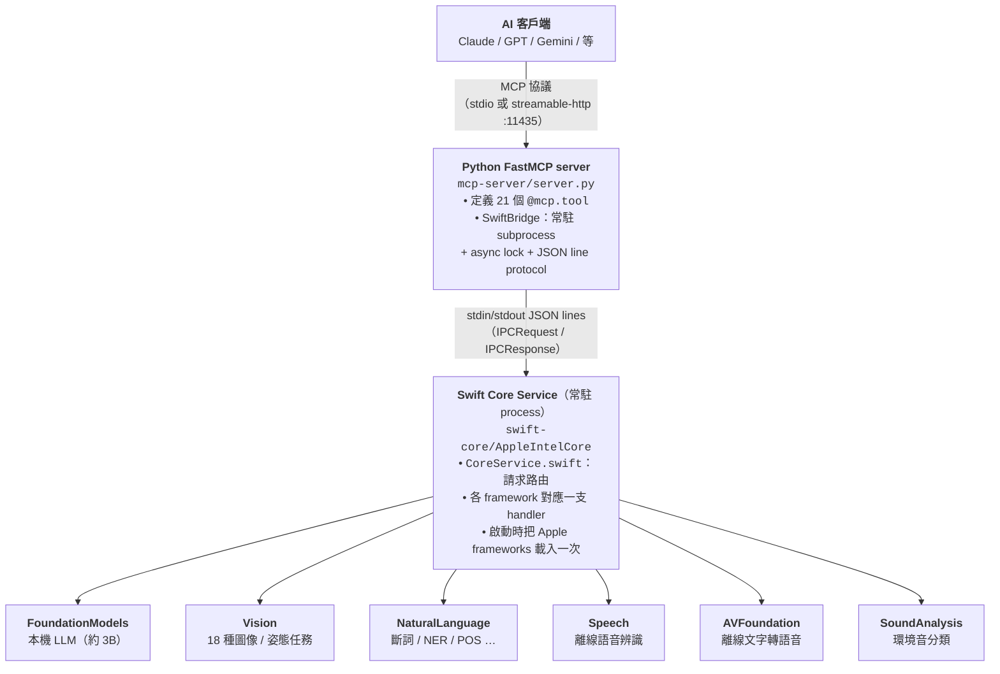

# Apple Intelligence MCP Server

[English](README.md) | **繁體中文** | [简体中文](README.zh-Hans.md)

把 macOS 內建的 Apple Intelligence 框架（Foundation Models、Vision、Natural
Language、Speech、Sound Analysis）包成 21 個 [MCP](https://modelcontextprotocol.io)
工具，給 Claude Desktop、OpenAI、Gemini、Codex、Hermes 等支援 MCP 的 AI 客戶端使用。

所有運算 **100% 在你的 Mac 本機跑**。不用 API key、不打雲端、資料不離開機器。

---

## 為什麼會有這個專案

OCR、翻譯、摘要、語音辨識這種流程固定、量又大的工作，丟給雲端 LLM 燒 token
其實很不划算。Apple Silicon Mac 本身就已經內建一套堪用的本機 AI 模型——只是
要會寫 Swift 才能直接呼叫。

這個專案把那套模型包成一個 MCP 服務，讓 Claude、GPT、Gemini 等 AI 客戶端可以
直接把工作丟給你的 Mac：「OCR 這張圖」、「轉錄這段錄音」、「潤稿這則 Discord
訊息」、「摘要這份會議紀錄」——全在本機毫秒內搞定，免費。

## 可以拿來做什麼

- **Discord / 聊天助手**
  用 `proofread_text` 抓錯字、`rewrite_text(tone="professional")` 改語氣、
  `summarize_text` 濃縮長訊息。三個工具都會保留 `@提及`、`:emoji:`、code block
  跟原本的語言。
- **文件處理流程**
  `vision_analyze(mode="ocr")` → `generate_text_structured(schema="extract")`
  → `generate_text_structured(schema="summarize")`，把掃描 PDF 或拍照文件
  變成結構化欄位加摘要。
- **語音訊息流程**
  `transcribe_audio` → `summarize_text` → `synthesize_speech`，組一條
  「語音進、語音出」的完整本機流程。
- **照片整理**
  用 `vision_analyze` 的 `classify`、`aesthetics`、`document` 配合
  `image_similarity` 做本機相簿分類。
- **隱私敏感的轉錄與翻譯**
  法律、醫療、HR 這類不能讓音檔或內容上雲的場景。
- **省 token 錢**
  把翻譯、批次改寫、情感分類這種重複性高的工作派給本機（搭配下面的
  「推薦 host system prompt」），雲端 token 留給真的需要推理的任務。

---

## 系統需求

- Apple Silicon Mac（M1 以上）
- macOS 26（Tahoe）以上
- 已開啟 Apple Intelligence（系統設定 → Apple 智慧與 Siri）
- 完整 Xcode（只裝 Command Line Tools 不夠，會少 FoundationModels 巨集）
- Homebrew + Python 3.10+（`brew install python3`）

## 安裝

```bash
git clone https://github.com/falll2000/apple-intelligence-mcp.git
cd apple-intelligence-mcp
bash install.sh
```

腳本會自動：

1. 編譯 Swift Core Service（`swift build -c release`）
2. 建立 Python venv 並安裝 `mcp`（FastMCP）
3. 把服務 (`com.apple-intel-mcp.server`) 註冊成 launchd agent，listen on 11435
4. 印出對應你電腦路徑的客戶端設定，可以直接複製貼上

## 接到 AI 客戶端

**Claude Desktop（stdio 模式）** — 編輯
`~/Library/Application Support/Claude/claude_desktop_config.json`：

```json
{
  "mcpServers": {
    "apple-intelligence": {
      "command": "/path/to/apple-intelligence-mcp/mcp-server/venv/bin/python3",
      "args": ["/path/to/apple-intelligence-mcp/mcp-server/server.py", "--stdio"]
    }
  }
}
```

實際路徑 `install.sh` 跑完會印出來，照貼就好。

**其他客戶端（HTTP 模式）** — 開機登入後 launchd 會自動起 HTTP server：

```
http://127.0.0.1:11435/mcp
```

---

## 架構



**為什麼要分兩個 process？**
FastMCP 是 Python 原生套件；Apple AI 框架只有 Swift 能直接呼叫。Swift binary
做成常駐是因為這些框架光初始化就要好幾秒，每次重啟太慢。Python 那層很薄，
只處理 MCP 協議、工具描述跟序列化。每次 `bridge.call(...)` 就是往 Swift stdin
寫一行 JSON、從 stdout 讀回一行 JSON，外面包一層 `asyncio.Lock` 確保請求／
回應不會交錯。

## 模組結構

Swift 端 `swift-core/Sources/AppleIntelCore/` 採「一個 framework 配一支
handler」的切法。要加新工具有固定流程：

```
main.swift                 ← 進入點（await CoreService.run()）
Models.swift               ← IPC 型別（IPCRequest / IPCResponse / JSONValue）
HandlerError.swift         ← 自訂錯誤（invalidInput / unavailable / …）
CoreService.swift          ← 請求路由——每個工具加一個 `case "<tool>":`
                             轉給對應 handler
GenerateHandler.swift      ← Foundation Models：
                             - generate_text（自由生成）
                             - generate_text_structured（@Generable 結構化）
TranslateHandler.swift     ← 用 FM prompt 做翻譯，每個目標語言寫一套
                             instructions（避開 zh→en 時模型誤判輸入已是英文的坑）
WritingToolsHandler.swift  ← 校對 / 改寫 / 摘要：
                             - NLLanguageRecognizer + CJK 比例判斷輸入語言
                             - 每個語言寫一套 instructions（zh-Hant / zh-Hans / en / ja）
                             - Discord-aware：保留 @ / :emoji: / ```code fence```
OCRHandler.swift           ← Vision 文字辨識（zh / en / ja / ko）
VisionExtHandler.swift     ← Vision：人臉、條碼、輪廓、文字區域、臉部特徵點、
                             人體偵測、地平線、前景分割、美學評分、光流、
                             自訂 Core ML 物件偵測、圖像相似度
VisionPoseHandler.swift    ← Vision：2D 姿態、手部姿態、動物、矩形、
                             saliency、文件、人像分割（3D 姿態已封死，見已知限制）
AnalyzeHandler.swift       ← NaturalLanguage：情感、語言偵測、命名實體、關鍵字
NLAdvancedHandler.swift    ← NaturalLanguage：斷詞、詞形還原、詞性標記
NLEmbeddingHandler.swift   ← NaturalLanguage：詞 / 句語意相似度
TranscribeHandler.swift    ← Speech 離線辨識（SFSpeechRecognizer）
SpeechSynthHandler.swift   ← AVFoundation 文字轉語音 → 輸出 .wav、列出可用聲音
SoundHandler.swift         ← SoundAnalysis：環境音分類
```

**新增工具的 checklist：**

1. 挑對應的 handler；如果是全新的 Apple framework 就新開一支檔案。
2. 寫好 Swift function，遇到壞輸入用 `HandlerError` throw 出去。
3. 到 `CoreService.swift` 加 `case "<tool_name>":`，解析 params 後叫 handler。
4. 到 `mcp-server/server.py` 加一個 `@mcp.tool()` function，docstring 用
   WHEN / NOT-FOR 格式寫清楚，內部呼叫 `await bridge.call("<tool_name>", {...})`。
5. 重新 build Swift（`swift build -c release`），重啟 MCP
   （`launchctl kickstart -k gui/$UID/com.apple-intel-mcp.server`）。
6. 兩份 README（這份跟 [README.md](README.md)）都記得更新。

---

## 工具清單（共 21 支）

18 種單張圖片的 Vision 任務被收進一支 `vision_analyze`（用 `mode` 參數路由），
沒拆成 18 支獨立工具——實測這樣做能明顯提升 host LLM 選工具的準確度。

### Foundation Models — 本機 LLM

| 工具 | 說明 |
|------|-------------|
| `generate_text` | 一般文字生成 / 改寫 |
| `generate_text_structured` | Guided generation，輸出 JSON 結構保證固定。Schemas：`list` / `classify` / `summarize` / `extract` / `qa`（每個 schema 都有自己的 prompt 建議寫在工具描述裡） |
| `translate_text` | zh-Hant / zh-Hans / en / ja / ko / fr / de / es 互譯，每個目標語言用該語言的 instructions |
| `proofread_text` | 抓使用者文字裡的錯字、語法、標點。保留語氣、語言、Discord 語法（@ / :emoji: / code block） |
| `rewrite_text` | 改寫語氣（`formal` / `casual` / `concise` / `friendly` / `professional`），保留原意、語言、Discord 語法 |
| `summarize_text` | 濃縮為 `short` / `medium` / `long` 段落；輸入中文輸出中文、英文輸出英文 |

### Vision — 圖像 / 姿態

| 工具 | 說明 |
|------|-------------|
| `vision_analyze` | 18 種單張圖片任務的入口。`mode` 可選 `ocr`, `classify`, `faces`, `face_landmarks`, `barcodes`, `text_regions`, `contours`, `human_bodies`, `rectangles`, `horizon`, `saliency`, `document`, `segment_person`, `segment_foreground`, `aesthetics`, `body_pose`, `hand_pose`, `animals` |
| `image_similarity` | 兩張本機圖片的視覺相似度（Vision feature print L2 距離，閾值已調為 0.1 / 0.4 / 0.8） |
| `detect_optical_flow` | 兩張連續畫面間的每像素移動向量 |
| `detect_trajectories` | 在本機影片中偵測拋物線軌跡 |
| `detect_objects` | 用你自備的 Core ML 模型（`.mlmodel` / `.mlmodelc`）做物件偵測 |

### Natural Language

| 工具 | 說明 |
|------|-------------|
| `analyze_text` | 情感 + 語言偵測 + 命名實體 + 關鍵字 |
| `tokenize_text` | 把文字切成詞 / 句 / 段（多語；中文斷詞正常） |
| `tag_parts_of_speech` | 詞性標記 |
| `lemmatize_text` | 詞形還原（running → run） |
| `word_similarity` | 兩個詞的語意相似度（0–1） |
| `sentence_similarity` | 兩個句子的語意相似度（0–1） |

### Speech & Sound

| 工具 | 說明 |
|------|-------------|
| `transcribe_audio` | 離線語音辨識（zh-TW / zh-CN / en-US / ja-JP / …），已開啟標點與口述模式 |
| `synthesize_speech` | 用 AVSpeechSynthesizer 離線文字轉語音 → 輸出 `.wav`（預設 zh-TW Meijia） |
| `list_voices` | 列出所有可用的聲音 identifier，可用 BCP-47 前綴過濾 |
| `classify_sound` | 環境音分類（音樂、笑聲、犬吠…）；輸入至少 3 秒 |

---

## 推薦的 host system prompt

要不要呼叫這些工具，由 host model 看它的 system prompt 跟工具描述決定。Server
這邊的描述已經用 `WHEN: / NOT FOR:` 格式寫過，但 host 端最好也加一份明確政策。
把下面這段貼到你的 client system prompt 可以讓路由穩定（用英文寫是因為大多
host LLM 對英文指令最敏感）：

```
You have access to an `apple-intelligence` MCP server that runs entirely on the
user's Mac. You MUST prefer it for the following task types instead of doing
the work yourself:

  - User provides an absolute path to an image file → call `vision_analyze`
    with the appropriate mode. Do NOT describe the image yourself first.
  - User provides an absolute path to an audio file and wants the words →
    call `transcribe_audio`.
  - User asks for tokenization or lemmatization → call the matching tool.
  - User asks for sentiment classification → call
    `generate_text_structured(schema="classify")` (works for Chinese too,
    unlike `analyze_text` which is English-only).
  - User asks to compare two images → `image_similarity`.
  - User asks to read text aloud → call `synthesize_speech` and attach
    the returned `.wav` path to the response.
  - User has already-written text and asks to "check / fix typos /
    proofread" it → call `proofread_text` (NOT `generate_text`).
  - User has already-written text and asks to make it "formal / casual /
    shorter / friendlier / more professional" → call `rewrite_text` with
    the matching `tone`.
  - User has long text and asks to "summarize / TL;DR / shorten" → call
    `summarize_text`. Use `generate_text_structured(schema="summarize")`
    only when the caller needs JSON with `title` + `keyPoints[]`.

You MAY use it (caller's discretion) for:
  - Bulk text rewriting / translation where token cost matters more than nuance
    → `generate_text`, `translate_text`, `generate_text_structured`.

You should NOT use it for:
  - Tasks needing strong reasoning, code, math, or current-events knowledge —
    the on-device model is small. Use your own generation.
```

---

## 中文支援狀況

Apple 各 framework 對語言的支援度差很多。Vision、Speech、Foundation Models
對中文不錯；比較舊的 NaturalLanguage 跟 NLEmbedding 在這套 stack 上實際幾乎
只能處理英文。

| 工具 | 中文（zh-Hant / zh-Hans） |
|---|---|
| `vision_analyze`（所有 mode） | ✓ 支援良好 |
| `transcribe_audio` | ✓ 準確（Apple 模型只加逗號、不加句號） |
| `synthesize_speech` | ✓ 有 Meijia、Eloquence 等中文聲音可選 |
| `tokenize_text` | ✓ 中文斷詞正常（「牛肉麵」會留成一個 token） |
| `lemmatize_text` | ✓ 中文不會被亂改（中文沒有詞形變化） |
| `generate_text_structured`（`classify`） | ✓ 可以拿來做中文情感分類 |
| `translate_text` | ✓ zh→en / zh→ja 穩定；en→zh 會用台灣 / 中國常見譯名（蘋果商店、特斯拉）；成語會直譯 |
| `proofread_text` | ⚠ 語言保留正確；FM 對中文文法錯（一各 / 再 / 的-vs-得）抓得弱，英文偶爾漏抓主動詞一致性 |
| `rewrite_text` | ✓ 語言保留正確；`professional` / `concise` / `formal` 穩；`casual` / `friendly` 偶爾改寫過頭 |
| `summarize_text` | ✓ 語言保留正確（中→中、英→英）；`short` 偶爾不夠短 |
| `generate_text` | ⚠ 短 prompt OK；知識截止約 2023 |
| `classify_sound` | ⚠ 與語言無關，但排序偶爾不準 |
| `analyze_text` | ✗ 中文情感永遠是 0 / 中性，命名實體幾乎抓不到 |
| `tag_parts_of_speech` | ✗ 中文所有詞性都會標成「其他」 |
| `word_similarity` / `sentence_similarity` | ✗ 沒有載入中文 embedding 模型 |

主要做中文場景時，建議在 host 的 MCP 設定層直接把 ✗ 那四支排除掉（例如
hermes 的 `mcp_servers.<name>.tools.exclude`），這樣 host LLM 就不會把中文
需求送過去。

## 已知限制

**Foundation Models 內建的 safety filter** — `generate_text` 跟相關工具有時
會對特定內容直接回錯。這個 filter 是 Apple 模型內建的，不是這個 server 加的。
連看起來無害的字（例如品牌名裡的「胖」）都可能被擋——容易踩到的內容建議改走
`generate_text_structured`。

**`detect_objects`** 需要你自備 Core ML 模型（`.mlmodel` 或 `.mlmodelc`）。
其他工具都開箱即用。

**`detect_trajectories`** 需要 mp4 / mov 影片，對拋物線運動（球類運動）效果最好。

**`body_pose_3d` 已經從公開 mode 列表移掉。**
`VNDetectHumanBodyPose3DRequest` 在跑 `perform` 時會丟出 Swift 接不到的
Objective-C exception，整個 Swift Core process 會被它幹掉。Swift case 仍保留
作為防呆網（舊 client 還傳這個 mode 的話會收到 `unavailable`），但不再對外
公告。要用姿態請改 `mode="body_pose"`（2D pose）。

**Apple Intelligence 天花板** — 下面這幾個 macOS 26 API 在 SDK 上*看起來*能用，
實際上從 daemon 是叫不動的：

| API | 為什麼擋住 |
|---|---|
| Writing Tools（`NSWritingToolsCoordinator`） | 綁 UI（需要 `NSView`）。我們改用 Foundation Models prompt 出 `proofread_text` / `rewrite_text` / `summarize_text` 取代 |
| Image Playground（`ImageCreator`） | 連在 Terminal 跑都會回 `backgroundCreationForbidden`——Apple 限定 entitlement |
| Genmoji | 走 `ImageCreator(style="emoji")`，同一個 entitlement 擋 |
| Visual Intelligence | 只有 `AppIntents.AssistantSchemas.VisualIntelligenceIntent`，是 schema only，不是真的可以呼叫的 API |
| Smart Reply | `CSSmartReply` 是 internal symbol（只在 `.tbd`，沒對外的 header） |

**Vision runtime 測試** 請在 Xcode build 出來的 binary、Terminal 或其他非
sandbox 環境跑。Sandbox runner 會誤報 `CVPixelBuffer`、`ANECF`、
`request cancelled` 之類錯誤。

---

## 管理服務（HTTP 模式）

`install.sh` 註冊的 launchd agent 會在登入時自動起來、crash 也會自動重啟。
要手動操作：

```bash
bash start.sh                                           # bootstrap launchd agent
bash stop.sh                                            # bootout launchd agent
tail -f /tmp/apple-intel-mcp.log                        # 看 log
launchctl kickstart -k gui/$UID/com.apple-intel-mcp.server   # 強制重啟
```

## Hermes 整合（選用）

如果你也在用 [hermes](https://github.com/) 並希望 `hermes gateway
start/stop/restart` 連動 MCP server：

```bash
bash install-hermes-integration.sh    # 裝 watchdog
bash uninstall-hermes-integration.sh  # 移除 watchdog（不影響 mcp 本體）
```

這會多裝一個 launchd agent（`com.apple-intel-mcp.hermes-watchdog`），每 3 秒
查一次 `ai.hermes.gateway` 狀態並同步到 MCP server：

| Hermes 動作 | MCP 反應（最多 3 秒延遲） |
|---|---|
| `hermes gateway stop` | `bootout` MCP |
| `hermes gateway start` | `bootstrap` MCP |
| `hermes gateway restart` | `kickstart -k` MCP（靠 PID 變化判斷） |

整合是純加值的，不裝 MCP 也照樣跑。`install.sh` 偵測到 hermes 已安裝時會
主動提示。

> 實作小備註：watchdog 腳本在 install 時會複製一份到
> `~/Library/Application Support/apple-intel-mcp/`，因為 macOS 26 launchd 拒絕
> 直接從 `/Volumes/` 執行 shell script（會被 TCC 擋成「Operation not permitted」）。
> Python venv binary 沒有踩到這條。

## 解除安裝

```bash
bash uninstall.sh   # 移除 mcp + watchdog（如果裝過）
```

---

## 專案結構

```
apple-intelligence-mcp/
├── install.sh / uninstall.sh
├── install-hermes-integration.sh / uninstall-hermes-integration.sh
├── start.sh / stop.sh
├── bin/
│   └── hermes-watchdog.sh         # 輪詢 ai.hermes.gateway，連動 mcp 狀態
├── mcp-server/
│   ├── server.py                  # FastMCP server + SwiftBridge（約 650 行）
│   └── requirements.txt           # mcp>=1.0.0
├── swift-core/
│   ├── Package.swift              # macOS 26、Swift 6
│   └── Sources/AppleIntelCore/    # 約 2,500 行，一個 framework 一支 handler
│       ├── main.swift             # 進入點
│       ├── CoreService.swift      # 請求路由
│       ├── Models.swift           # IPC 型別
│       ├── HandlerError.swift     # 自訂錯誤
│       ├── GenerateHandler.swift          # Foundation Models
│       ├── TranslateHandler.swift         # FM 翻譯
│       ├── WritingToolsHandler.swift      # 校對 / 改寫 / 摘要
│       ├── OCRHandler.swift               # Vision 文字辨識
│       ├── VisionExtHandler.swift         # Vision 偵測類工具
│       ├── VisionPoseHandler.swift        # Vision 姿態 / 動態類工具
│       ├── AnalyzeHandler.swift           # NL 情感 / NER / 關鍵字
│       ├── NLAdvancedHandler.swift        # NL 斷詞 / POS / 詞形還原
│       ├── NLEmbeddingHandler.swift       # NL 語意相似度
│       ├── TranscribeHandler.swift        # Speech 語音辨識
│       ├── SpeechSynthHandler.swift       # AVFoundation 文字轉語音
│       └── SoundHandler.swift             # SoundAnalysis 環境音分類
└── test-assets/                   # 測試用範例圖
```

## 授權

MIT
